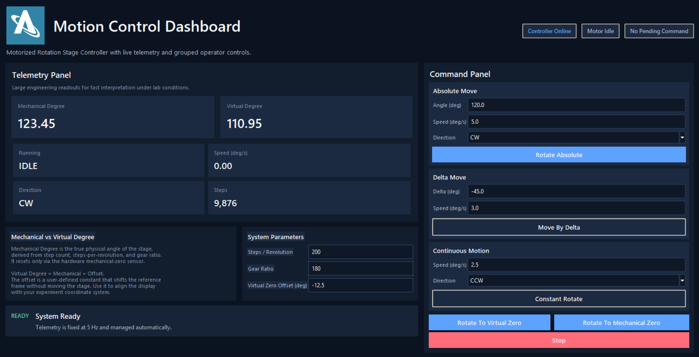

# Motorized Rotation Stage Controller



## Purpose
This system controls a motorized rotation stage from a Windows PC.

You can operate it in two ways:

- through the desktop UI
- through the Python API / command line

The system supports:

- rotate to an absolute angle
- rotate by a relative angle
- rotate to mechanical zero
- rotate to virtual zero
- stop motion
- telemetry reporting

Telemetry shows the current stage state while the system is running, including angle, motion state, speed, direction, and step count.

## Before You Start
Make sure all hardware is connected before launching the software.

Required hardware:

- controller board connected to the PC by USB
- motor driver connected to the controller
- motor connected to the driver
- rotation stage mechanically coupled to the motor
- controller and motor driver powered correctly
- mechanical zero sensor connected and working

Safety checks before first motion:

1. Make sure the stage can rotate freely.
2. Remove tools, loose cables, and hands from the moving area.
3. Verify the motor driver is powered and enabled.


Important:

- The system will move the stage during initialization.
- On startup, the UI first homes the stage by rotating CCW toward mechanical zero.
- If the motion direction is wrong or unsafe, press `Stop` immediately and power down if needed.

## How to Start the System
Follow these steps in order.

### 1. Connect and power the hardware

1. Connect the motor to the motor driver.
2. Connect the motor driver to the controller.
3. Connect the home sensor to the controller.
4. Connect the controller to the PC with USB.
5. Power the controller and motor driver.

### 2. Open the project folder

Open PowerShell in the project folder:

```powershell
cd The_path_to_the_code\motorized_rotation_stage
```

### 3. Launch the hardware UI

Recommended Windows command:

```powershell
.\start_rotation_stage.bat or just double click on the start_rotation_stage.bat icone
```

If needed, you can also start the UI directly:

```powershell
python -m pc_app.ui.hardware_app
```

If auto-detection does not find the controller, specify the COM port:

```powershell
python -m pc_app.ui.hardware_app COM4
```

Replace `COM4` with the actual controller port on your PC.

### 4. Confirm the system starts correctly

When the UI opens, expect this sequence:

1. The application connects to the controller.
2. The startup dialog appears.
3. The stage automatically rotates CCW to find mechanical zero.
4. When homing is complete, the virtual-zero input becomes available.
5. Enter the required `Virtual Zero Reference (deg)`.
6. Click `Apply and Continue`.

### 5. Confirm telemetry is working

After startup completes, verify the telemetry panel is updating.

You should see values for:

- `Mechanical Degree`
- `Virtual Degree`
- `Running`
- `Speed (deg/s)`
- `Direction`
- `Steps`

Normal signs that communication is working:

- values are numbers, not `--`
- `Running` changes between `IDLE` and `RUNNING`
- `Direction` changes when motion direction changes
- `Steps` changes while the motor is moving

## How to Use the UI

### System Parameters
The `System Parameters` panel shows the stage configuration.

Current fields:

- `Steps / Revolution`
- `Gear Ratio`
- `Virtual Zero Reference (deg)`

What they mean:

- `Steps / Revolution`: motor step count used by the system
- `Gear Ratio`: mechanical reduction between motor and stage
- `Virtual Zero Reference (deg)`: user-defined offset between physical zero and working zero

Important:

- In the current UI, `Steps / Revolution` and `Gear Ratio` are display-only.
- In the current UI, only `Virtual Zero Reference (deg)` is editable.
- If `Steps / Revolution` or `Gear Ratio` are wrong, do not continue normal operation. Ask the responsible engineer to correct the system configuration before use.

### Telemetry Panel
The `Telemetry Panel` shows the live state of the stage.

Plain-English meaning:

- `Mechanical Degree`: the physical stage angle based on the controller position
- `Virtual Degree`: the angle relative to your chosen virtual zero reference
- `Running`: whether the controller is currently moving the stage
- `Speed (deg/s)`: current commanded speed
- `Direction`: `CW` or `CCW`
- `Steps`: internal step count reported by the controller

### Command Panel
The `Command Panel` contains the motion controls:

- `Rotate Absolute`
- `Move By Delta`
- `Constant Rotate`
- `Rotate To Virtual Zero`
- `Rotate To Mechanical Zero`
- `Stop`


## API / Command-Line Usage
This section is for operators who prefer commands or scripts.

### Run the API example while the UI is open
Recommended method:

1. Start the UI first.
2. Leave the UI open.
3. Open a second PowerShell window in the project folder.
4. Run:

```powershell
python example_api_usage.py
```

This connects the API example to the same shared controller session used by the UI.

If you do not want the API script to take priority over UI commands, run:

```powershell
python example_api_usage.py --no-acquire-control
```

Important:

- Do not use `--direct` while the UI is open.
- `--direct` tries to open the COM port itself and will conflict with the UI.

### Run the API example by itself
If you are not using the UI and want direct serial control:

```powershell
python example_api_usage.py --direct COM4
```

Replace `COM4` with the correct port.

### Example direct serial commands
If you are using a serial terminal or test utility, example controller commands are:

```text
CMD,ROT_HOME
CMD,ROT_VZERO,10.00
CMD,ROT_ABS,120.00,10.00,5.0,CW
CMD,ROT_REL,45.00,3.0,CCW
CMD,ROT_CONST,2.5,CCW
CMD,STOP
CMD,TLM,-1
CMD,TLM,20
CMD,TLM,0
```

## Typical Operating Workflow

1. Connect the motor, driver, home sensor, controller, and USB cable.
2. Power the controller and motor driver.
3. Open PowerShell in the project folder.
4. Activate the Python environment if needed.
5. Start the UI with `.\start_rotation_stage.bat`.
6. Wait for the UI to connect and begin startup homing.
7. Let the stage rotate CCW to mechanical zero.
8. Enter the `Virtual Zero Reference (deg)` when prompted.
9. Click `Apply and Continue`.
10. Verify telemetry is updating and looks reasonable.
11. Perform the required motion commands.
12. Watch telemetry during motion.
13. Press `Stop` if anything looks wrong.
14. Close the system safely when work is complete.

## Troubleshooting

| Problem | Likely cause | What to check | What to do next |
|---|---|---|---|
| UI opens but telemetry shows `--` | no controller connection | USB cable, power, COM port, controller boot | restart the UI, try `python -m pc_app.ui.hardware_app COM4` with the correct port |
| Stage does not move | driver not powered, motor not connected, command rejected | driver power, enable line, motor wiring, status message | correct hardware issue, then try again |
| Stage moves in the wrong direction | motor wiring or expected direction is reversed | compare actual motion to selected `CW` / `CCW` | press `Stop` and correct the setup before continuing |
| Mechanical zero is not found | home sensor not wired, not reachable, or not switching correctly | home sensor wiring, sensor indicator, mechanical path | stop the test and verify the sensor physically triggers at the correct position |
| Stage stops before reaching the home sensor | false home detection | sensor wiring, noise, grounding, sensor state | do not continue normal use; troubleshoot the home sensor signal first |
| Command rejected or UI shows failure | invalid value or communication problem | angle, speed, direction, USB connection | correct the input and retry |
| Telemetry values look wrong | system not homed, wrong virtual zero, wrong stage configuration | run mechanical zero again, confirm virtual zero, review displayed steps/rev and gear ratio | re-home and re-enter virtual zero before continuing |
| `Access is denied` on `COMx` | another program already owns the serial port | another UI, Python script, Arduino serial monitor, terminal | close the other program or use the shared UI + API method instead of `--direct` |
| API script cannot connect to `127.0.0.1:8765` | shared server not running | whether the hardware UI is open | start the UI first, then run `python example_api_usage.py` |
| Stop button pressed but motion continues | command not reaching the controller or hardware issue | status message, telemetry, USB connection | press `Stop` again; if unsafe, cut power using lab safety procedure |

## How to Shut Down Safely

1. If the stage is moving, click `Stop`.
2. Wait until telemetry shows `Running = IDLE`.
3. Close the UI.
4. Close any API scripts or extra terminals using the system.
5. Power off the motor driver and controller using your normal lab procedure.
6. Disconnect USB only after motion and power-down are complete.

## Quick Commands

Launch the UI:

```powershell
.\start_rotation_stage.bat
```

Launch the UI directly:

```powershell
python -m pc_app.ui.hardware_app
```

Launch the UI on a specific port:

```powershell
python -m pc_app.ui.hardware_app COM4
```

Run the API example while the UI is open:

```powershell
python example_api_usage.py
```

Run the API example without taking priority over the UI:

```powershell
python example_api_usage.py --no-acquire-control
```

Run the API example directly on a COM port:

```powershell
python example_api_usage.py --direct COM4
```
